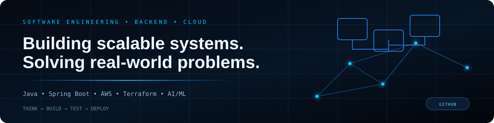

<div align="center">



# Gaurav Ojha

### Software Engineering · Backend · Cloud & DevOps · AI/ML

**CSE Student building practical software systems, backend APIs, cloud infrastructure, and AI/ML applications.**

<p>
<a href="https://gaurav-ojha-portfolio.netlify.app">Portfolio</a> ·
<a href="https://www.linkedin.com/in/gaurav-ojha18/">LinkedIn</a> ·
<a href="https://github.com/Gaurav-Ojha65">GitHub</a> ·
<a href="mailto:gauravojhavaranasi@gmail.com">Email</a>
</p>

</div>

---

## 👨‍💻 About

I enjoy taking a problem from **idea → architecture → implementation → testing → deployment**.

- 🔧 Building with **Java, Spring Boot, REST APIs, Python, React and Node.js**
- ☁️ Working with **AWS, Linux, Docker, Terraform, Ansible and CI/CD**
- 🤖 Exploring **ML systems, explainability, RAG and LLM pipelines**
- 🧠 Strengthening **DSA, backend engineering and system design fundamentals**
- 📌 Interested in **Software Engineering, Backend and Cloud/DevOps opportunities**

<details>
<summary><b>🎯 Current engineering focus</b></summary>

```text
Backend Engineering  →  Spring Boot · REST · JPA · PostgreSQL
Cloud & DevOps       →  AWS · Linux · Docker · Terraform · Ansible
AI / ML              →  Python · XGBoost · LightGBM · SHAP · MLflow
Engineering Practice →  Testing · CI/CD · Observability · Documentation
```

</details>

---

## 🛠️ Tech Stack

### Backend & Languages

<p>


</p>

### Frontend

<p>


</p>

### Cloud & DevOps

<p>


</p>

### Databases & AI / ML

<p>


</p>

---

## 🚀 Featured Projects

### 🏦 Mortgage AI Decision System

AI-powered mortgage risk assessment system combining ML experimentation with a production-style application stack.

**Highlights:** ensemble modeling · SHAP explainability · fairness auditing · FastAPI · React · Redis · PostgreSQL · Docker Compose · MLflow · Prometheus · Grafana · GitHub Actions

**Engineering signal:** **AI/ML + Backend + Testing + Infrastructure**

→ **[View Repository](https://github.com/Gaurav-Ojha65/Mortgage_AI)**

---

### ☁️ Highly Available Three-Tier AWS Infrastructure

Infrastructure-as-Code project deploying a multi-AZ three-tier architecture with isolated public/private networking and automated configuration.

**Highlights:** VPC · public/private subnets · ALB · EC2 · RDS MySQL · NAT Gateways · Bastion Host · Security Groups · Terraform · Ansible

**Engineering signal:** **AWS + Networking + IaC + DevOps**

→ **[View Repository](https://github.com/Gaurav-Ojha65/ha-three-tier-aws)**

---

### 🎓 CollegeFind

Full-stack college discovery platform with search, comparison, authentication, saved colleges and rank-prediction features.

**Highlights:** Next.js · Node.js/Express · PostgreSQL/Supabase · JWT · REST APIs · deployed frontend/backend

**Engineering signal:** **Full-Stack + Backend + Database + Authentication**

→ **[View Repository](https://github.com/Gaurav-Ojha65/CollegeFind)**

---

### ⚙️ Deadlock Prevention & Recovery Toolkit

Interactive systems project implementing deadlock detection, Banker's Algorithm, recovery logic, simulation and visualization.

**Highlights:** Operating Systems · algorithms · simulation · logging · visualization

**Engineering signal:** **CS Fundamentals + Algorithms + Implementation**

→ **[View Repository](https://github.com/Gaurav-Ojha65/Deadlock-Prevention-Bankers_Algorithm-Toolkit)**

---

## 📊 Engineering Snapshot

<div align="center">

| Focus | Evidence |
|:---|:---|
| 💻 Software Engineering | Backend APIs · Full-stack applications · Testing |
| ☁️ Cloud & DevOps | AWS · Terraform · Ansible · Docker · CI/CD |
| 🤖 AI/ML | Ensemble models · Explainability · Fairness · MLOps |
| 🧠 DSA | 150+ problems across LeetCode, CodeChef and TUF |

</div>

---

## 🧩 How I Build

```text
Understand the problem
        ↓
Design the architecture
        ↓
Build the smallest working version
        ↓
Test and measure
        ↓
Containerize / automate
        ↓
Document and improve
```

> I prefer **working, explainable engineering over buzzword-heavy projects.**

---

## 📈 GitHub Activity

<div align="center">


</div>

---

## 🤝 Let's Connect

<div align="center">

**Interested in Software Engineering · Backend · Cloud/DevOps · AI/ML**

[](https://www.linkedin.com/in/gaurav-ojha18/)
[](https://gaurav-ojha-portfolio.netlify.app)
[](https://github.com/Gaurav-Ojha65)

</div>
